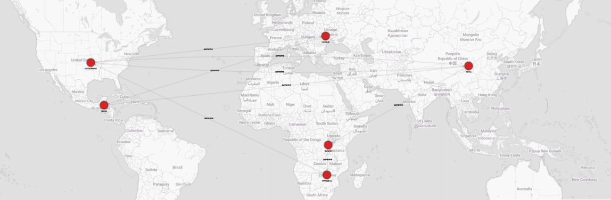

# 1. Introduction to Cypher
## 1.1 What is a Graph-Oriented Database? (Recap)
A graph-oriented database stores data in a structure made up of nodes, relationships, and properties. Unlike traditional databases that store information in tables and rows, graph databases represent entities and their connections more naturally—especially useful for complex, interconnected data.

Memgraph is a high-performance in-memory graph database that leverages the property graph model and is fully compatible with Cypher, the popular graph query language. It is built for real-time analytics and streaming data, making it ideal for applications like fraud detection, recommendation systems, and monitoring networks.

## 1.2 Comparison with Relational Databases (Contextualized)
While relational databases are great for structured data and fixed schemas, they can become inefficient and hard to manage when dealing with deep relationships, multi-level joins, and evolving connections between data points.

| Aspect | Relational Database | Graph Database (Memgraph) |
| --- | --- | --- | 
| Data model | Tables, rows, columns | Nodes, relationships, properties |
|Relationships	|Through foreign keys and joins	|Stored directly as edges|
|Querying|	SQL (structured query language)|	Cypher (graph query language)|
|Performance|	Slows down with joins|	Fast traversal of relationships|
|Flexibility	|Rigid schema	|Schema-optional|

In graph databases, relationships are first-class citizens, allowing for efficient traversal and more intuitive queries—especially as data grows in complexity.

1.3 Why Use Memgraph and Cypher?
Memgraph is optimized for real-time and streaming use cases, while still offering a familiar query language—Cypher—that makes graph querying accessible even to those with SQL backgrounds.

Key benefits of using Memgraph with Cypher:
* Real-time performance: Thanks to in-memory architecture and streaming support.
* Cypher-compatible: Developers familiar with Neo4j can easily migrate.
* Streaming support: Integrates with Kafka, Pulsar, and other event sources.
* Developer-friendly: Comes with visual tools like Memgraph Lab and supports Graph Data Science workflows.

Cypher allows you to express complex pattern-matching queries in a readable, declarative way. It helps you focus on what data you want, not how to fetch it—mirroring SQL’s strengths, but designed for graph data.

# 2. Presentation of Cypher
## 2.1 What is Cypher?
Cypher is a declarative query language designed specifically for querying and updating graph databases. It allows users to express complex graph patterns intuitively, using ASCII-art–like syntax to describe relationships in a way that's readable and efficient.

Cypher was originally developed by Neo4j but is now supported by other graph database systems such as Memgraph, which adds high-performance, real-time capabilities.

* Think of Cypher as to graphs what SQL is to tables: a powerful, human-readable way to get what you need from your data.

## 2.2 Objectives and Benefits of Cypher
Cypher was created to make working with graph data intuitive, efficient, and accessible, even for those coming from a relational background.

Key Objectives:
* Simplicity: Easy to learn for those familiar with SQL or basic database concepts.
* Expressiveness: Allows for complex queries involving multiple relationships and conditions, written concisely.
* Readability: Syntax resembles the structure of the graph, making it easier to understand and maintain.

Benefits:
* Declarative: You describe what you want, not how to get it.
* Efficient for traversals: Optimized for navigating nodes and relationships.
* Strong community & tools: Broad adoption across platforms like Neo4j, Memgraph, and others.

## 2.3 Comparison with SQL
Cypher and SQL share some common ideas (SELECT, WHERE clauses), but their approach to relationships is fundamentally different.

### Key Differences:

| Feature | SQL (Relational DB) | Cypher (Graph DB) |
| --- | --- | --- | 
| Data Model | Tables and rows | Nodes and relationships |
|Joins|	Performed manually|	Built-in relationships|
|Relationships|	Based on foreign keys|	First-class citizens|
|Query Language	|SQL	|Cypher|
|Syntax|	Tabular, keyword-heavy|	Pattern-based, visual|

### Example: SQL vs. Cypher

Let's imagine a database containing trade balances.

##### SQL Query:
```SQL
SELECT c1.name AS exporter, c2.name AS importer, e.amount
FROM Exports e
JOIN Country c1 ON e.country_from_id = c1.id
JOIN Country c2 ON e.country_to_id = c2.id
WHERE c1.iso2 = 'CH' AND e.amount > 1000;
```
##### Cypher Query
```Cypher
MATCH (n:Country {iso2:"CH"})-[e:EXPORTS]->(m)
WHERE e.amount > 1000 
RETURN n.name AS exporter, m.name AS importer, e.amount;
```
## 2.4 Why Choose Cypher?
Cypher is a compelling choice for developers and data scientists working with graph data because it offers:
* A gentle learning curve: Especially for those familiar with SQL.
* Powerful graph traversal: Naturally suited for pathfinding, recommendation systems, fraud detection, etc.
* Clean syntax: Queries resemble the data structure itself.
* Compatibility with Memgraph: Use Cypher to build real-time graph applications with streaming data.

Whether you're analyzing social networks, supply chains, or real-time systems, Cypher gives you the tools to navigate your data intuitively and efficiently.

# 3. The Fundamental Concepts of Cypher (Expanded)

In this section, we’ll explore the core data model of Cypher using Memgraph and apply it to our dataset, which represents countries and their trade relationships.

Even though we briefly introduced these concepts earlier, here we focus on how they translate into Cypher syntax and practice, using real examples from our dataset.

## Nodes

Definition: Nodes represent entities or objects in a graph. In our case, each country is a node.

* Example Node (Switzerland):
```
{
"labels": ["Country"],
"properties": {
"name": "Switzerland",
"iso2": "CH",
"iso3": "CHE",
"lat": 46.818188,
"lng": 8.227512,
"balance": 33547.68,
"total_export_amount": 306882.68,
"total_import_amount": 273335
}
}
```

* Cypher Representation:
```Cypher
(:Country {
  name: "Switzerland",
  iso2: "CH",
  iso3: "CHE",
  lat: 46.818188,
  lng: 8.227512,
  balance: 33547.68,
  total_export_amount: 306882.68,
  total_import_amount: 273335
})
```
## Relationships

Definition: Relationships represent how nodes are connected. They are directional and can have properties.

* Example Relationship: Switzerland exports to the UAE.
```
{
"label": "EXPORTS",
"start": 16537,
"end": 16563,
"properties": {
"amount": 9413.88
}
}
```
Cypher Representation:
```Cypher
(:Country)-[:EXPORTS {amount: 9413.88}]->(:Country)
```

## Properties in Nodes and Relationships

* Properties store additional data.
* They are key-value pairs, and can exist in both nodes and relationships.
* Example (from Switzerland node):
  * `name`: "Switzerland"
  * `balance`: 33547.68
  * `total_import_amount`: 273335
* Example (from EXPORTS relationship):
  * `amount`: 9413.88

These properties allow us to perform filtering, calculations, and ordering in Cypher queries.
## Labels and Relationship Types
* Labels categorize nodes. A node can have one or more labels (like `:Country`).
* Relationship types define the kind of connection (like `:EXPORTS`, `:IMPORTS`, etc.).

In Cypher:
```Cypher
(:Country)-[:EXPORTS]->(:Country)
```
* `:Country` is a node label.
* `:EXPORTS` is a relationship type.

These elements allow for precise pattern matching in queries using Cypher.

To filter countries based on their trade balance:
```Cypher
MATCH (c:Country)
WHERE c.balance > 0
RETURN c.name, c.balance
```
This query retrieves all countries with a positive trade balance. With China having the highest trade balance and the USA having the largest deficit, such queries can help uncover economic trends.

## Summary
Understanding nodes, relationships, properties, and labels is essential to writing and reading Cypher queries. With this foundation, we can now begin creating, modifying, and querying data in Memgraph using Cypher, which we will explore in the next sections.

# 4. Data Manipulation with Cypher (Memgraph)
In this section, we’ll explore how to use Cypher to interact with data inside a graph database, specifically Memgraph. We’ll build and modify a graph representing international trade, focusing on a fictional country: Elbonia.

We’ll walk through:
* Creating nodes and relationships
* Updating data
* Deleting elements

Let’s get started!
## 4.1 Creating Nodes and Relationships
Creating a Country Node for Elbonia
In Memgraph, we use the `CREATE` keyword to add nodes. Here’s how we can define Elbonia with its properties:

```Cypher
CREATE (e:Country {
    id: 99999,
    iso2: 'EB',
    iso3: 'ELB',
    name: 'Elbonia',
    lat: 51.1657,
    lng: 10.4515,
    balance: 1000000.00,
    total_export_amount: 150000.00,
    total_import_amount: 120000.00
})
```
This creates a node labeled `Country` with geographic and economic attributes.

### Create Trade Relationships
Let’s now link Elbonia to Switzerland, France, Austria, and the USA using the EXPORTS relationship.

```Cypher
MATCH (e:Country {name: 'Elbonia'}), (u:Country {name: 'USA'})
CREATE (e)-[r:EXPORTS {amount: 25000.00}]->(us);
MATCH (e:Country {name: 'Elbonia'}), (a:Country {name: 'Austria'})
CREATE (e)-[r:EXPORTS {amount: 12000.00}]->(at);
MATCH (e:Country {name: 'Elbonia'}), (f:Country {name: 'France'})
CREATE (e)-[r:EXPORTS {amount: 15000.00}]->(fr);
MATCH (e:Country {name: 'Elbonia'}), (s:Country {name: 'Switzerland'})
CREATE (e)-[r:EXPORTS {amount: 20000.00}]->(ch);
```
## 4.2 Updating Data

Let's now say that due to the new tariffs, Elbonia now exports only half as much to the USA as it used to. We can update the `EXPORTS` relationship between Elbonia and USA.

### Example: Updating Export Amount to the USA

```Cypher
MATCH (e:Country {name: 'Elbonia'})-[r:EXPORTS]->(u:Country {name: 'USA'})
SET r.amount = r.amount / 2
RETURN r;
```
* Explanation: This query finds the `EXPORTS` relationship between Elbonia and USA, and updates the `amount` to half its previous value (due to the tariffs).
* Result: The export amount from Elbonia to USA is now updated.

## 4.3 Deleting Nodes and Relationships
If we want to delete a relationship or node, we can use the `DELETE` command. For example, if we decide to remove Elbonia’s trade link with France:
```Cypher
MATCH (e:Country {name: 'Elbonia'})-[r:EXPORTS]->(f:Country {name: 'France'})
DELETE r;
```
This query removes the relationship between Elbonia and France.

If we want to delete a node, we can simply use:
```Cypher
MATCH (e:Country {name: 'Elbonia'})
DELETE e;
```
This query would fail if Elbonia has any relationships, because it can’t delete a node that still has relationships.

However, if you want to delete Elbonia and all the relationships attached to it, you would use:
```Cypher
MATCH (e:Country {name: 'Elbonia'})
DETACH DELETE e;
```
This deletes the Elbonia node and all the relationships connected to it, ensuring that there are no orphaned relationships in the graph.

## 4.4 Summary of Key Cypher Commands for Data Manipulation
|Operation	|Cypher Command|
|---|---|
|Create Node	|CREATE (n:Label {properties})|
|Create Relationship|	CREATE (a)-[:REL_TYPE]->(b)|
|Find Node| MATCH (n:Label{properties})|
|Update Data|	SET (n.property = value)|
|Delete Node|	DELETE (n)|
|Delete Relationship|	DELETE (a)-[r]->(b)|
|Delete Node and Relationship| DETACH DELETE (n)|

# 5. Exploring Cypher Queries with Memgraph
## 1. Searching for Countries with Positive Balances

Now let's look at our first query:
```Cypher
MATCH (c:Country)
WHERE c.balance > 0
RETURN c.name, c.balance
```

Explanation:
* MATCH (c:Country): This part of the query searches for all nodes with the label Country.
* WHERE c.balance > 0: We are filtering the countries where the balance is greater than 0 (i.e., countries with a positive balance).
* RETURN c.name, c.balance: This will return the name and balance properties of each country that satisfies the condition.

## 2. Searching for Countries that Export to Switzerland
In this next query, we want to search for all countries that have an export relationship with Switzerland.

Cypher Query:
```Cypher
MATCH (c:Country)-[r:EXPORTS]->(s:Country {name: 'Switzerland'})
RETURN c.name, r.amount
```
Explanation:
* MATCH (c:Country)-[r:EXPORTS]->(s:Country {name: 'Switzerland'}): This looks for all Country nodes that have an EXPORTS relationship to the Country node named "Switzerland".
* RETURN c.name, r.amount: It returns the name of the exporting country (c.name) and the amount of exports (r.amount) in the relationship.
* This query allows you to find the countries that are exporting goods to Switzerland and the total amount of exports.

## 3. Aggregating Total Export Amount for All Countries
Here, we calculate the total export amount across all countries.

Cypher Query:
```Cypher
MATCH (c:Country)
RETURN SUM(c.total_export_amount) AS total_exports
```
Explanation:
* MATCH (c:Country): This part finds all nodes labeled Country.
* RETURN SUM(c.total_export_amount) AS total_exports: It sums the total_export_amount property of all countries and returns the total as total_exports.
* This is a great example of using aggregation functions in Cypher, similar to SQL's SUM().


## 4. Filtering Countries with a Positive Balance and High Export Amounts
In this query, we filter countries with both a positive balance and a high export amount.

Cypher Query:
```Cypher
MATCH (c:Country)
WHERE c.balance > 0 AND c.total_export_amount > 100000
RETURN c.name, c.balance, c.total_export_amount
```

Explanation:
* MATCH (c:Country): Finds all countries.
* WHERE c.balance > 0 AND c.total_export_amount > 100000: Filters the countries that have both a positive balance and total_export_amount greater than 100000.
* RETURN c.name, c.balance, c.total_export_amount: Returns the name, balance, and total_export_amount for those countries that meet the criteria.

This query combines multiple conditions in the WHERE clause, which is common in complex graph queries.

## 5. Exploring paths
In this query:
* We want to extract the following:
* Direct export from China → USA
* Direct export from USA → China
* Cheapest export path (by total export amount) from China to USA, involving exactly 4 countries (3 relationships)

```Cypher
// 1. Direct export from China to USA
MATCH path1 = (c1:Country {name: 'China'})-[r1:EXPORTS]->(u1:Country {name: 'United States'})

// 2. Direct export from USA to China
MATCH path2 = (u2:Country {name: 'United States'})-[r2:EXPORTS]->(c2:Country {name: 'China'})

// 3. Shortest export path with 4 nodes (3 hops) from China to USA
MATCH path3 = (start1:Country {name: 'China'})-[:EXPORTS*3]->(end1:Country {name: 'United States'})
WITH path1, path2, path3,
     REDUCE(total1 = 0, r IN relationships(path3) | total1 + r.amount) AS total_export1
ORDER BY total_export1 ASC
LIMIT 1

// 4. Shortest export path with 4 nodes (3 hops) from USA to China
MATCH path4 = (start2:Country {name: 'United States'})-[:EXPORTS*3]->(end2:Country {name: 'China'})
WITH path1, path2, path3, total_export1, path4,
     REDUCE(total2 = 0, r IN relationships(path4) | total2 + r.amount) AS total_export2
ORDER BY total_export2 ASC
LIMIT 1

// Final return
RETURN 
  path1 AS China_to_USA_direct, 
  path2 AS USA_to_China_direct,
  path3 AS China_to_USA_4node_path, 
  total_export1 AS China_to_USA_total,
  path4 AS USA_to_China_4node_path, 
  total_export2 AS USA_to_China_total
```
### Explanation of Each Section
#### 1. Direct Export from China to USA

```Cypher
MATCH path1 = (c1:Country {name: 'China'})-[r1:EXPORTS]->(u1:Country {name: 'United States'})
```
This line finds a direct `EXPORTS` relationship going from the country node `"China"` to the country node `"United States"`.

#### 2. Direct Export from USA to China

```Cypher
MATCH path2 = (u2:Country {name: 'United States'})-[r2:EXPORTS]->(c2:Country {name: 'China'})
```
Same idea as above, but now looking for a direct export from the USA to China.
#### 3. Shortest Export Path (4 Nodes) from China to USA
```Cypher
MATCH path3 = (start1:Country {name: 'China'})-[:EXPORTS*3]->(end1:Country {name: 'United States'})
```
* `[:EXPORTS*3]`: Matches paths with exactly 3 relationships (which means 4 countries involved).
* This path could go through intermediate countries (e.g., China → Burundi → Zimbabwe → USA).
```Cypher
REDUCE(total1 = 0, r IN relationships(path3) | total1 + r.amount) AS total_export1
```
* `REDUCE` is used to sum the amount values on all `EXPORTS` relationships in the path.
* The path is then sorted by total_export1 ASC to find the one with the smallest total trade volume.
```Cypher
ORDER BY total_export1 ASC
LIMIT 1
``` 
* Only the smallest total export path is kept.

#### 4. Shortest Export Path (4 Nodes) from USA to China
```Cypher
MATCH path4 = (start2:Country {name: 'United States'})-[:EXPORTS*3]->(end2:Country {name: 'China'})
```
Same logic, but the path starts in the USA and ends in China.
```Cypher
REDUCE(total2 = 0, r IN relationships(path4) | total2 + r.amount) AS total_export2
ORDER BY total_export2 ASC
LIMIT 1
```
This gives the shortest export path in terms of total amount when going USA → China.
#### Final Output

```Cypher
RETURN 
  path1 AS China_to_USA_direct, 
  path2 AS USA_to_China_direct,
  path3 AS China_to_USA_4node_path, 
  total_export1 AS China_to_USA_total,
  path4 AS USA_to_China_4node_path, 
  total_export2 AS USA_to_China_total
```
This returns:
* The direct path from China to USA (if it exists)
* The direct path from USA to China (if it exists)
* The best 4-node path from China to USA, and its total export value
* The best 4-node path from USA to China, and its total export value

# Conclusion: Why Learn Cypher and Use It in Memgraph?
Throughout this introduction, we've seen how Cypher provides a powerful, human-readable language to interact with graph databases. It makes working with complex, interconnected data intuitive and efficient, especially when compared to traditional SQL.

While many graph databases use Cypher, we will be working with Memgraph, a high-performance, in-memory graph database built for speed, flexibility, and real-time analytics. Memgraph fully supports Cypher, allowing us to take advantage of everything we’ve just covered.
